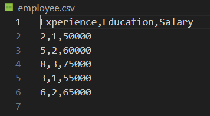
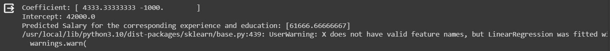

# Implementation of Multivariate Linear Regression
# Name:ABDULLAH R
## Aim
To write a python program to implement multivariate linear regression and predict the output.
## Equipment’s required:
1.	Hardware – PCs
2.	Anaconda – Python 3.7 Installation / Moodle-Code Runner
## Algorithm:
### Step1: Import panda
### Step2: Import linear model from sklearn 
### Step3: Read the file cars.csv 
### Step4: Assign the values for x and y as required 
### Step5: Create the linearRegression model and predict the output
<br>

## Program:
``````

import pandas as pd
from sklearn import linear_model

df = pd.read_csv('employee.csv')

x = df[['Experience', 'Education']]
y = df['Salary']

regr = linear_model.LinearRegression()
regr.fit(x, y)

print("Coefficient:", regr.coef_)
print("Intercept:", regr.intercept_)

new_employee = [[5, 2]]  
predicted_salary = regr.predict(new_employee)

print("Predicted Salary for the corresponding experience and education:", predicted_salary)
``````
## Output:





<br>

## Result
Thus the multivariate linear regression is implemented and predicted the output using python program.